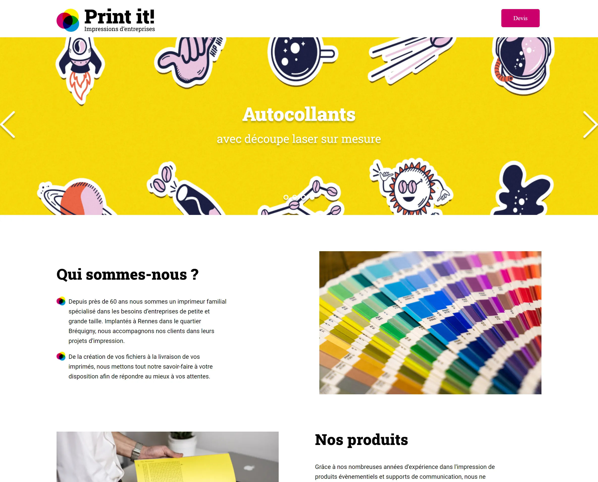

# Print-It!

## Site is live at: https://h9791.github.io/Print_It/

The project consists of implementation of a dynamic slider in the header of an **existing page**. User can click on arrows and slides move around correspondingly. User can also slick on dots at the bottom of the slider to access a particular slide.

&nbsp;

